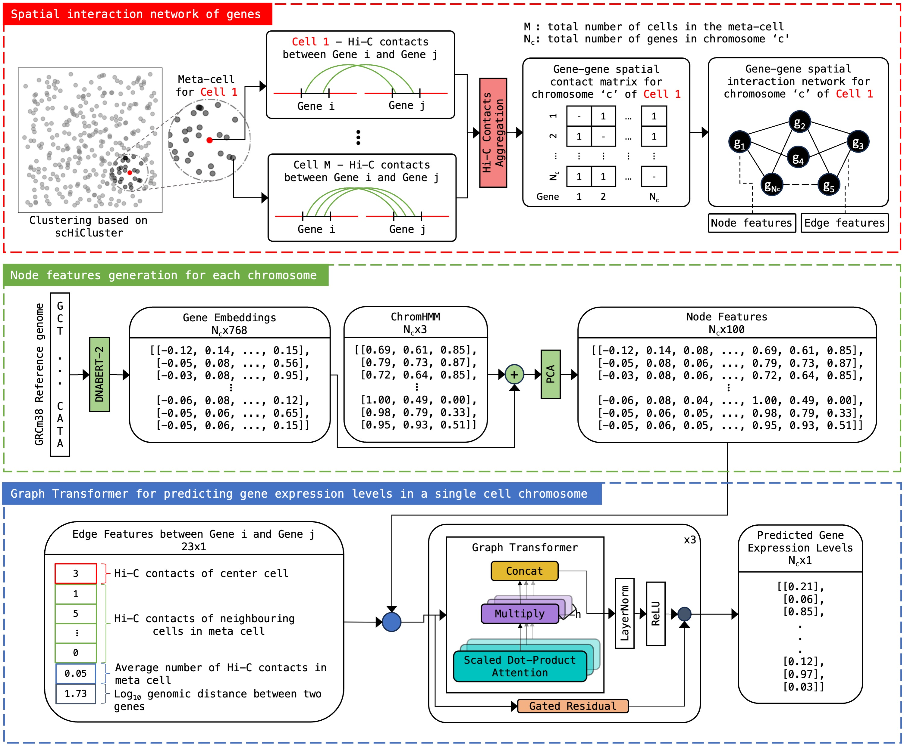

# scHiGex: predicting single-cell gene expression based on single-cell Hi-C data



This repository includes code and a pre-trained model of scHiGex for single-cell gene expression prediction.

## Instructions

### Python Environment
The code was tested on Python 3.10.4. The conda environment is shared via `environment.yml`, and for dnabert2, the environment is shared via `environment_dnabert2.yml`.

### Dataset
The dataset used for training is from the [HiRES](    https://www.science.org/doi/10.1126/science.adg3797) experiment. The dataset is available at [https://www.ncbi.nlm.nih.gov/geo/query/acc.cgi?acc=GSE223917](https://www.ncbi.nlm.nih.gov/geo/query/acc.cgi?acc=GSE223917).

Files to be placed in the `assets` directory are as follows:
- assets/
    - [gencode.vM23.annotation.gtf](https://ftp.ebi.ac.uk/pub/databases/gencode/Gencode_mouse/release_M23/gencode.vM23.annotation.gtf.gz)
    - [mm10.fa](https://hgdownload.soe.ucsc.edu/goldenPath/mm10/bigZips/mm10.fa.gz)
    - [mm10_100_segments_browser.bed](https://public.hoffman2.idre.ucla.edu/ernst/2K9RS//full_stack/full_stack_annotation_public_release/mm10/mm10_100_segments_browser.bed.gz)
    - rna_umicount.tsv - [embryo](https://www.ncbi.nlm.nih.gov/geo/download/?acc=GSE223917&format=file&file=GSE223917%5FHiRES%5Femb%2Erna%2Eumicount%2Etsv%2Egz)
    - metadata.xlsx - [embryo](https://www.ncbi.nlm.nih.gov/geo/download/?acc=GSE223917&format=file&file=GSE223917%5FHiRES%5Femb%5Fmetadata%2Exlsx)
    - pairs/ (Required for training)
        - [Hi-C pairs files](https://www.ncbi.nlm.nih.gov/geo/download/?acc=GSE223917&format=file)


### Training
To train the scHiGex model from scratch for mm10, 
- Download and place the required files in the `assets` directory.
- Run the python scripts inside the `scripts` directory in the order of the numbers prefixed to the file names. These scripts will generate the required data files for training the model.
- Run `./train.sh` to train the model.

### Prediction
To predict gene expression levels using the trained model for mm10,

- Download and place the required files in the `assets` directory (aparts from pairs files since there is no training involved).
- Run the following python scripts inside the `scripts` directory (Goal is to create chromosome definitions inside `scripts` directory):
    - `1.1_run_gtfparse.py`
    - `1.2_generate_metadata.py`
    
- Place the .pairs files in the `predict` directory:
    - Group of Hi-C .pairs file that you want to predict gene expressions of inside the directory `predict/pairs/`. At least 20 pairs files for each cell types are required to create the meta-cell.
    - example:
        - `predict/pairs/`
            - `cell_type_1/`
                - `cell_type_1_1.pairs`
                - `cell_type_1_2.pairs`
                - ...
            - `cell_type_2/`
                - `cell_type_2_1.pairs`
                - `cell_type_2_2.pairs`
                - ...
            - ...

- Run `python 1.data_prep.py` to generate the required data files for prediction.
- Run `python 2.predict.py` to predict gene expression levels.
- The predicted gene expression levels will be saved in the `predict` directory under the file name `predictions.csv`

 If you want to use your own trained model using scHiGex architecture, you need to point to right model file and node_embeddings.

<hr>

> The scripts were desinged to be compatible with the HiRES data for the experiment. The code can be easily modified to work according to the user's purpose.


### Citation
Please cite the following paper:
``` 
@article{scHiGex,
  title={scHiGex: predicting single-cell gene expression based on single-cell Hi-C data},
  author={Bishal Shrestha, Andrew Jordan Siciliano, Hao Zhu, Tong Liu, Zheng Wang},
  journal={},
  year={2024}
}
```